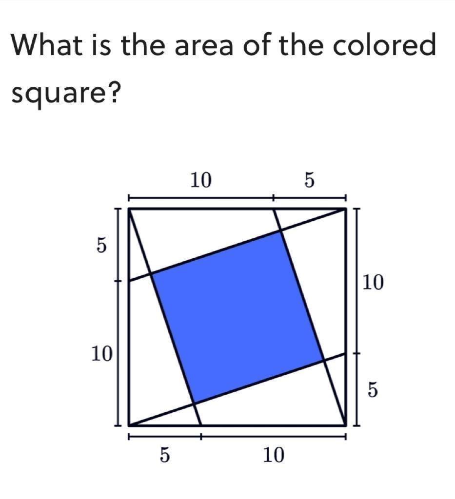
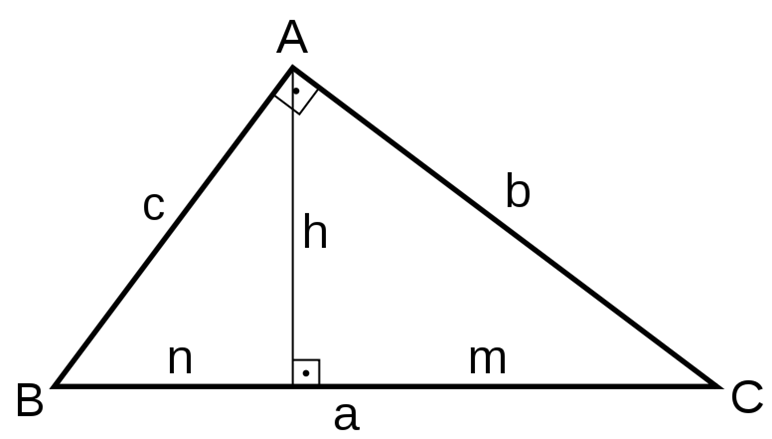

# inside_square
## Problem: Calculate the inner blue square in the image shown


### There are mutiple ways to solve the problem.  One way is to use the Altitude-on-hypotenuse Theorem


```math
h^2=m*n
b^2=a*m
c^2=a*n
```
In this project we want to dynamically show and calculate the area of the inner square for various values of the outer square from 0 to 100
